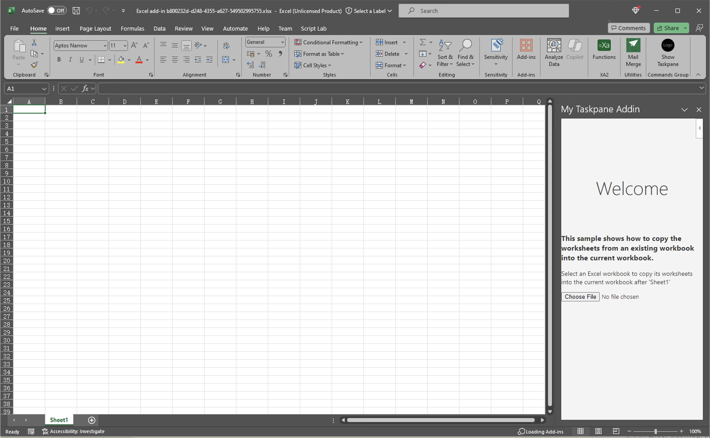

# Insert an external Excel file and populate it with JSON data

This sample shows how to insert an existing template from an external Excel file into the currently open Excel file. Then it retrieves data from a JSON web service and populates the template for the customer.

### Features
- Use insertWorksheetsFromBase64 to insert a worksheet from another Excel file into the open Excel file.
- Get JSON data and add it to the worksheet.

## Sample Demo Video


## Required Steps & How to Run

### Prerequisites
To run the completed project in this folder, you need the following:
- [Node.js](https://nodejs.org) installed on your development machine. (**Note:** This tutorial was written with Node version 16.14.0. The steps in this guide may work with other versions, but that has not been tested.)
- Either a personal Microsoft account with a mailbox on Outlook.com, or a Microsoft work or school account. You can [sign up for the Microsoft 365 Developer Program](https://developer.microsoft.com/microsoft-365/dev-program) to get a free Microsoft 365 subscription.

### Run the sample on Windows and Mac

Run the following command in your CLI to start the application.
```
npm run build
npm start
```

### Expected result

A webpack server will be hosted on https://localhost:3000/, as the CLI shows:


An Excel desktop application will be auto-launched and this Addin will be auto-run on the right taskpane area. The sideload steps has been integrated into the process, eliminating the need for manual intervention.



Please follow the steps below:

1. Click the button "Choose File" to choose the Excel file you want to inserted into the worksheet. You can also use the provided file nameds as "SalesTemplate.xlsx" to have a test.

2. Then, the provided Excel file will be inserted into current worksheet.

3. What's more, we will also automate appendix an worksheet using the provided "JSONData.json"

### Sideload the sample add-in on Excel Online

The previous steps show you how to run our sample on Desktop. As for the Excel Online, please follow the following steps to sideload the manifest.xml file on web.

1.  **Keep the webpack server on** to host your sample add-in.
1.  Open [Office on the web](https://office.live.com/).
1.  Choose **Excel**, and then open a new document.
1.  On the **Home** tab, in the **Add-ins** section, choose **Add-ins** and click **More Add-ins** on the lower-right corner to open Add-in Store Page.
1.  On the **Office Add-ins** dialog, select the **MY ADD-INS** tab, choose **Manage My Add-ins**, and then **Upload My Add-in**.

    

1.  Browse to the localhost add-in manifest file(manifest-localhost.xml), and then select **Upload**.

    

1.  Verify that the add-in loaded successfully. 


## Feedback
Did you experience any problems with the sample? [Create an issue]( https://github.com/OfficeDev/Word-Scenario-based-Add-in-Samples/issues/new) and we'll help you out.

Let us know your experience using our sample code for Office add-in development: [Sample survey](https://aka.ms/OfficeDevSampleSurvey).

## Copyright
Copyright (c) 2021 Microsoft Corporation. All rights reserved.
This project has adopted the [Microsoft Open Source Code of Conduct](https://opensource.microsoft.com/codeofconduct/). For more information, see the [Code of Conduct FAQ](https://opensource.microsoft.com/codeofconduct/faq/) or contact [opencode@microsoft.com](mailto:opencode@microsoft.com) with any additional questions or comments.
<br>**Note**: The taskpane.html file contains an image URL that tracks diagnostic data for this sample add-in. Please remove the image tag if you reuse this sample in your own code project.


## Disclaimer
**THIS CODE IS PROVIDED *AS IS* WITHOUT WARRANTY OF ANY KIND, EITHER EXPRESS OR IMPLIED, INCLUDING ANY IMPLIED WARRANTIES OF FITNESS FOR A PARTICULAR PURPOSE, MERCHANTABILITY, OR NON-INFRINGEMENT.**
