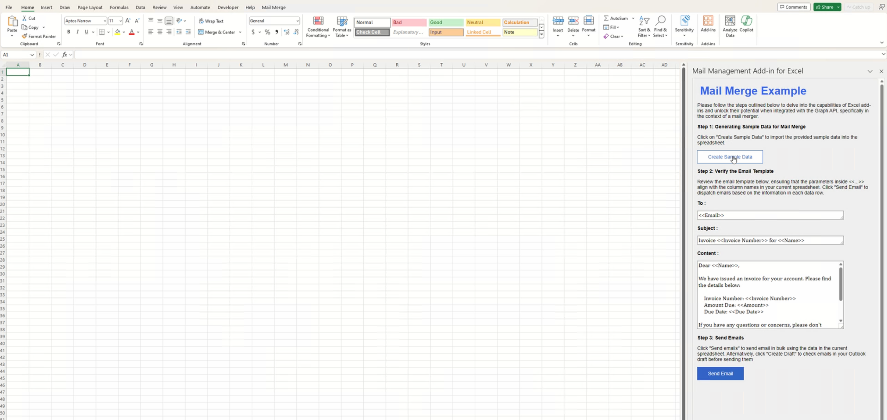

# Excel Mail Merge Sample Office Add-in


This sample demonstrates how to use the Microsoft Graph JavaScript SDK to send emails in Excel from Office Add-ins.

### Features
- Create Sample Data, including valid email address (required) and other information.
- Verify Template and Data, the To Line must contain the column name of the email address.
- Send Email, which will pop up a dialog to get the consent of Microsoft Graph. After sign-in, the email will be send out.

## How to run this sample

### Prerequisites
- [Node.js](https://nodejs.org) 16, 18, or 20 (18 is preferred) and [npm](https://www.npmjs.com/get-npm). To verify if you've already installed these tools, run the commands `node -v` and `npm -v` in your terminal.
- [Office Add-in Dev Kit](https://marketplace.visualstudio.com/items?itemName=msoffice.microsoft-office-add-in-debugger) version 0.4.0 and higher.
- Office connected to a Microsoft 365 subscription. You might qualify for a Microsoft 365 E5 developer subscription through the [Microsoft 365 Developer Program](
https://developer.microsoft.com/microsoft-365/dev-program), see [FAQ](
https://learn.microsoft.com/office/developer-program/microsoft-365-developer-program-faq#who-qualifies-for-a-microsoft-365-e5-developer-subscription-) for details.
Alternatively, you can [sign up for a 1-month free trial](
https://www.microsoft.com/microsoft-365/try?rtc=1)
or [purchase a Microsoft 365 plan](
https://www.microsoft.com/microsoft-365/buy/compare-all-microsoft-365-products).

### Register a web application with the Azure Active Directory admin center
1. If you have an application ID already, please ensure: 

- In [Microsoft Entra admin center](https://aad.portal.azure.com) under **Identity > Applications > App registrations**: 
- Navigate to **Redirect URI**, set the first drop-down to `Single-page application (SPA)` and its value to `https://localhost:3000/consent.html`.

2. Otherwise, if you haven't registered a web application with the Azure Active Directory admin center, please follow the steps below:

- Open a browser and navigate to the [Microsoft Entra admin center](https://aad.portal.azure.com). Login using a **personal account** (aka: Microsoft Account) or **Work or School Account**.

- Select **Identity** in the left-hand navigation, then select **App registrations** under **Applications**.
- Select **New registration**. On the **App registrations** page, set the values as follows.
    - Set **Name** to `Office Add-in Graph Tutorial`.
    - Set **Supported account types** to **Accounts in any organizational directory and personal Microsoft accounts**.
    - Under **Redirect URI**, set the first drop-down to `Single-page application (SPA)` and set the value to `https://localhost:3000/consent.html`.

- Select **Register**. On the **Office Add-in Graph Tutorial** page, copy the value of the **Application (client) ID** and save it, you will need it in the next step.
- Edit the `taskpane.js` file and make the following changes.
- Replace `YOUR_APP_ID_HERE` with the **Application Id** you got from the App Registration Portal.


#### Run the add-in using Office Add-in Dev Kit
[Office Add-in Dev Kit](https://marketplace.visualstudio.com/items?itemName=msoffice.microsoft-office-add-in-debugger) is an end-to end developer tool for building Office add-ins. You can use this tool to easily creating, running and debugging, and managing the lifecycle of an Office add-in.
<br>

1. **Check and Install Dependencies**

    Select `Check and Install Dependencies` to check your environment and install necessary dependencies in order to run and debug the add-in code.

2. **Preview Your Office Add-in (F5)**
    
    Select `Preview Your Office Add-in(F5)` on the side panel to start running and debugging the add-in code. A Word/Excel/PowerPoint app will launch with the add-in sample side-loaded.
    * To debug on Office on the web, go to [Sideload Office Add-ins to Office on the web](https://learn.microsoft.com/office/dev/add-ins/testing/sideload-office-add-ins-for-testing)
    * To debug in Desktop (Edge Legacy), go to [Debug Edge Legacy Webview](https://learn.microsoft.com/office/dev/add-ins/testing/debug-add-ins-using-devtools-edge-legacy)
    
    **If you meet sideload errors, please first confirm the following items and check [troubleshoot development errors]( https://learn.microsoft.com/en-us/office/dev/add-ins/testing/troubleshoot-development-errors) for common issues. If you still have problems, [Create an issue](https://github.com/OfficeDev/office-js/issues/new/choose) and we'll help you out.** 
    
    * You have installed dependencies.
    * You have closed all Word/Excel/PowerPoint apps.
    * You have stopped your last add-in previewing session.

3. **Stop Previewing Your Office Add-in**

    Select `Stop Previewing Your Office Add-in` to stop debugging.

### How to use the sample
An Excel desktop application will be auto-launched and the Mail Merge Addin will be auto-run on the right taskpane area. The sideload steps has been integrated into the process, eliminating the need for manual intervention.



Please follow the steps below:

1. Create Sample Data, including valid email address (required) and other information.

2. Verify Template and Data, the To Line must contain the column name of the email address.

3. Send Email, which will pop up a dialog to get the consent of Microsoft Graph. After sign-in, the email will be send out. <br>

### Explore sample files
To explore the components of the add-in project, review the key files listed below. 
<br>You can check whether your manifest file is valid by selecting `Validate Manifest` in the `Office Add-in Dev Kit` extension tree view.
```
| .eslintrc.json
| .gitignore
| .vscode/
|   | extensions.json
|   | launch.json               Launch and debug configurations
|   | settings.json             
|   | tasks.json                
| assets/                       Static assets like image/gif
| babel.config.json
| manifest*.xml                 Manifest file
| package.json                  
| README.md                     Get started here
| SECURITY.md
| src/                          Add-ins source code
|   | commands/
|   |   | commands.html
|   |   | commands.js
|   | taskpane/
|   |   | taskpane.css          Taskpane style
|   |   | taskpane.html         Taskpane entry html
|   |   | taskpane.js           Add API calls and logic here
| webpack.config.js             Webpack config
```

### Make code changes
**Resources to learn more Office add-ins capabilities:**
* Select `View Samples` on `Office Add-in Dev Kit` tree view for real-world examples and code structures.
* [Read the documentation](https://learn.microsoft.com/office/dev/add-ins/overview/office-add-ins) of Office add-ins.

## Engage with the team
Did you experience any problems with the sample? [Create an issue]( https://github.com/OfficeDev/Office-Samples/issues/new) and we'll help you out.

Want to learn more about new features, development practices, and additional information? [Join the Microsoft Office Add-ins community call.](https://learn.microsoft.com/office/dev/add-ins/overview/office-add-ins-community-call)

## Copyright
Copyright (c) 2024 Microsoft Corporation. All rights reserved.
This project has adopted the [Microsoft Open Source Code of Conduct](https://opensource.microsoft.com/codeofconduct/). For more information, see the [Code of Conduct FAQ](https://opensource.microsoft.com/codeofconduct/faq/) or contact [opencode@microsoft.com](mailto:opencode@microsoft.com) with any additional questions or comments.
<br>**Note**: The taskpane.html file contains an image URL that tracks diagnostic data for this sample add-in. Please remove the image tag if you reuse this sample in your own code project.


## Disclaimer
**THIS CODE IS PROVIDED *AS IS* WITHOUT WARRANTY OF ANY KIND, EITHER EXPRESS OR IMPLIED, INCLUDING ANY IMPLIED WARRANTIES OF FITNESS FOR A PARTICULAR PURPOSE, MERCHANTABILITY, OR NON-INFRINGEMENT.**
