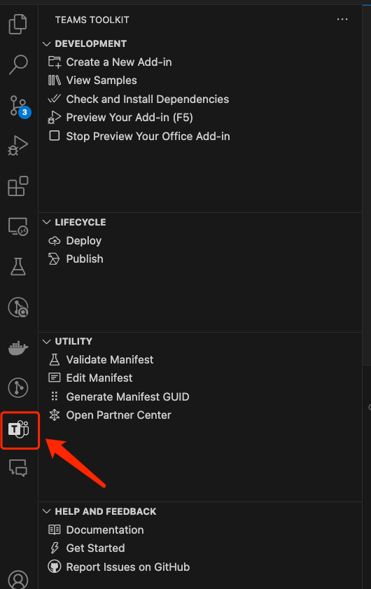

## Required Steps & How to Run

### Prerequisites
- [Node.js](https://nodejs.org) 16/18 (Tested on 16.14.0)

### Run & Debug
1. Open M365/Teams Toolkit
 </img>
2. Click `Check and Install Dependency`
3. Launch and debug
    * For debugging in Office on Windows/macOS, click `Preview Your Office Add-in(F5)` button on tree view and select a launch config. A Word/Excel/PowerPoint app will launch with add-in sample side-loaded. **Note:** Debugging on macOS is not supported yet.
    * For debugging in Office on the web: [Sideload Office Add-ins to Office on the web](https://learn.microsoft.com/en-us/office/dev/add-ins/testing/sideload-office-add-ins-for-testing)

### How to use this sample
1. EXAMPLE: Put the steps about how to use this sample.
2. EXAMPLE: Register an API key in XXXXXX
3. EXAMPLE: Replace the API key in xxxxx.js
4. EXAMPLE

## Feedback
Did you experience any problems with the sample? [Create an issue]( https://github.com/OfficeDev/Office-Samples/issues/new) and we'll help you out.

## Copyright
Copyright (c) 2024 Microsoft Corporation. All rights reserved.
This project has adopted the [Microsoft Open Source Code of Conduct](https://opensource.microsoft.com/codeofconduct/). For more information, see the [Code of Conduct FAQ](https://opensource.microsoft.com/codeofconduct/faq/) or contact [opencode@microsoft.com](mailto:opencode@microsoft.com) with any additional questions or comments.
 **Note**: The taskpane.html file contains an image URL that tracks diagnostic data for this sample add-in. Please remove the image tag if you reuse this sample in your own code project.

## Disclaimer
**THIS CODE IS PROVIDED *AS IS* WITHOUT WARRANTY OF ANY KIND, EITHER EXPRESS OR IMPLIED, INCLUDING ANY IMPLIED WARRANTIES OF FITNESS FOR A PARTICULAR PURPOSE, MERCHANTABILITY, OR NON-INFRINGEMENT.**
