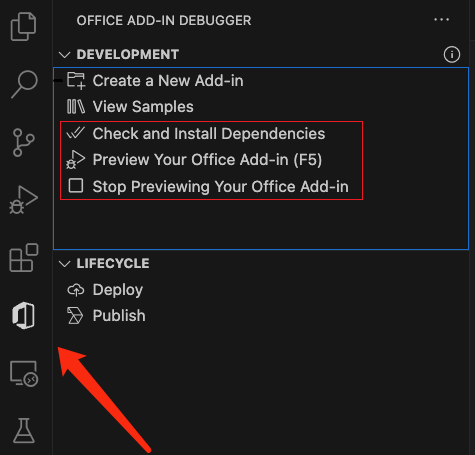

## DELETE_PUT_SAMPLE_TITLE_HERE_DELETE


**Describe sample functionality**, DELETE_EXAMPLE: This sample shows how to insert an existing template from an external Excel file into the currently open Excel file. Then it retrieves data from a JSON web service and populates the template for the customer. 

### Features
- DELETE_Features of this sample: which APIs are used, what service is called....
- DELETE_EXAMPLE: Use insertWorksheetsFromBase64 to insert a worksheet from another Excel file into the open Excel file.
- DELETE_EXAMPLE: Get JSON data and add it to the worksheet.

## How to run this sample

### Prerequisites
- [Node.js](https://nodejs.org) 16 or 18 (Tested on DELETE_16.14.0_THIS_USE_ANOTHER_VERSION) and [npm](https://www.npmjs.com/get-npm). To verify if you've already installed these tools, run the commands node -v and npm -v in your terminal.
- [Office Add-in Dev Kit](https://marketplace.visualstudio.com/items?itemName=msoffice.microsoft-office-add-in-debugger) version 0.4.0 and higher.
- Office connected to a Microsoft 365 subscription. You might qualify for a Microsoft 365 E5 developer subscription through the [Microsoft 365 Developer Program](
https://developer.microsoft.com/microsoft-365/dev-program), see [FAQ](
https://learn.microsoft.com/office/developer-program/microsoft-365-developer-program-faq#who-qualifies-for-a-microsoft-365-e5-developer-subscription-) for details.
Alternatively, you can [sign up for a 1-month free trial](
https://www.microsoft.com/microsoft-365/try?rtc=1)
or [purchase a Microsoft 365 plan](
https://www.microsoft.com/microsoft-365/buy/compare-all-microsoft-365-products).


### Run the add-in using Office Add-in Dev Kit
[Office Add-in Dev Kit](https://marketplace.visualstudio.com/items?itemName=msoffice.microsoft-office-add-in-debugger) is an end-to end developer tool for building Office add-ins. You can use this tool to easily creating, running and debugging, and managing the lifecycle of an Office add-in.
<br>

1. **Check and Install Dependencies**

    Select `Check and Install Dependencies` to install npm dependencies before debugging.

3. **Preview Your Office Add-in (F5)**
    
    Select `Preview Your Office Add-in(F5)` on tree view and select a launch config. A Word/Excel/PowerPoint app will launch with add-in sample side-loaded. 
    * To debug on Office on the web, go to [Sideload Office Add-ins to Office on the web](https://learn.microsoft.com/office/dev/add-ins/testing/sideload-office-add-ins-for-testing)
    * To debug in Desktop (Edge Legacy), go to [Debug Edge Legacy Webview](https://learn.microsoft.com/office/dev/add-ins/testing/debug-add-ins-using-devtools-edge-legacy)
    
    **If you meet sideload errors, please first confirm the following items and check [troubleshoot development errors]( https://learn.microsoft.com/en-us/office/dev/add-ins/testing/troubleshoot-development-errors) for common issues. If you still have problems, [Create an issue](https://github.com/OfficeDev/office-js/issues/new/choose) and we'll help you out.** 
    
    * You have installed dependencies.
    * You have closed all Word/Excel/PowerPoint apps.
    * You have stopped your last add-in previewing session.

4. **Stop Previewing Your Office Add-in**

    Select `Stop Previewing Your Office Add-in` to stop debugging.

## How to use this sample
You can try out the sample add-in when it is sideloaded on Word/Excel/PowerPoint apps:

1. DELETE_EXAMPLE: Put the steps about how to use this sample.
2. DELETE_EXAMPLE: Register an API key in XXXXXX
3. DELETE_EXAMPLE: Replace the API key in xxxxx.js
4. DELETE_EXAMPLE

### Explore sample files
DELETE_THIS_LINE:Use copilot chat @workspace to generate folder structure
```
| .eslintrc.json
| .gitignore
| .vscode/
|   | extensions.json
|   | launch.json               Launch and debug configurations
|   | settings.json             
|   | tasks.json                
| assets/                       Static assets like image/gif
| babel.config.json
| manifest.xml                 Manifest file
| package.json                  
| README.md                     Get started here
| SECURITY.md
| src/                          Add-ins source code
|   | commands/
|   |   | commands.html
|   |   | commands.js
|   | taskpane/
|   |   | taskpane.css          Taskpane style
|   |   | taskpane.html         Taskpane entry html
|   |   | taskpane.js           Add API calls and logic here
| webpack.config.js             Webpack config
```

### Make code changes
**GitHub Copilot extension for Office Add-ins:** 
DELETE_THIS_LINE: Only shows in projects generated by GitHub Copilot extension.
1. Type in `@office` to invoke the extension.
1. Type in `/generatecode` and describe the feature you would like to build, then send the request to Copilot.
1. Get the response from the extension and use the code.
<br>

**Resources to learn more Office add-ins capabilities:**
* Select `View Samples` on `Office Add-in Dev Kit` tree view for real-world examples and code structures.
* [Read the documentation](https://learn.microsoft.com/office/dev/add-ins/overview/office-add-ins) of Office add-ins.

## Engage with the team
Did you experience any problems with the sample? [Create an issue]( https://github.com/OfficeDev/Office-Samples/issues/new) and we'll help you out.

Want to learn more about new features, development practices, and additional information? [Join the Microsoft Office Add-ins community call.](https://learn.microsoft.com/office/dev/add-ins/overview/office-add-ins-community-call)

## Copyright
Copyright (c) 2024 Microsoft Corporation. All rights reserved.
This project has adopted the [Microsoft Open Source Code of Conduct](https://opensource.microsoft.com/codeofconduct/). For more information, see the [Code of Conduct FAQ](https://opensource.microsoft.com/codeofconduct/faq/) or contact [opencode@microsoft.com](mailto:opencode@microsoft.com) with any additional questions or comments.
<br>**Note**: The taskpane.html file contains an image URL that tracks diagnostic data for this sample add-in. Please remove the image tag if you reuse this sample in your own code project.


## Disclaimer
**THIS CODE IS PROVIDED *AS IS* WITHOUT WARRANTY OF ANY KIND, EITHER EXPRESS OR IMPLIED, INCLUDING ANY IMPLIED WARRANTIES OF FITNESS FOR A PARTICULAR PURPOSE, MERCHANTABILITY, OR NON-INFRINGEMENT.**
