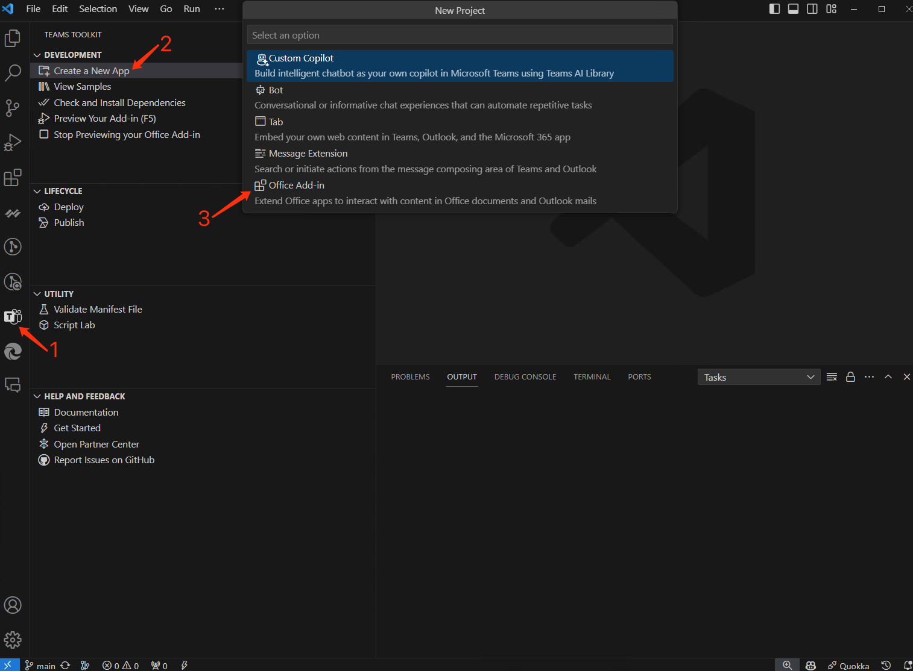
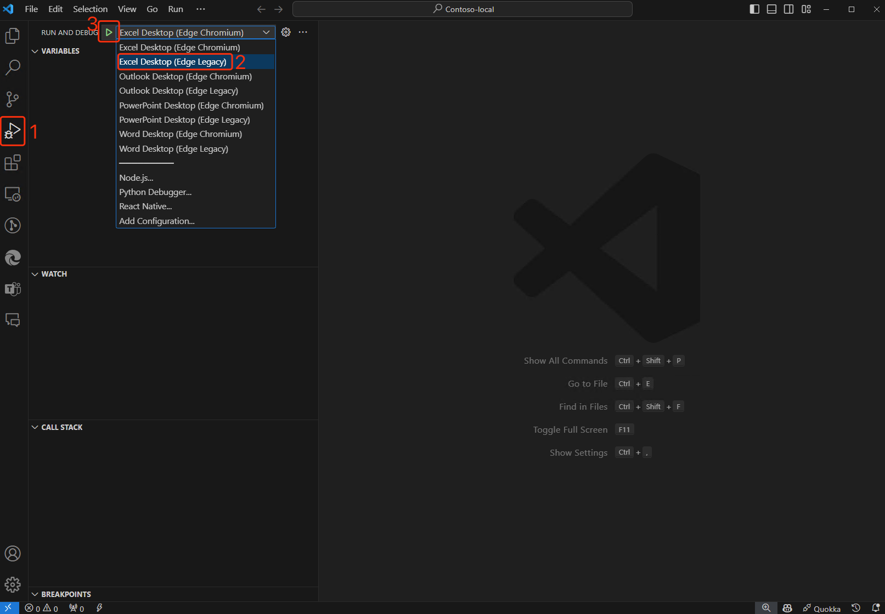
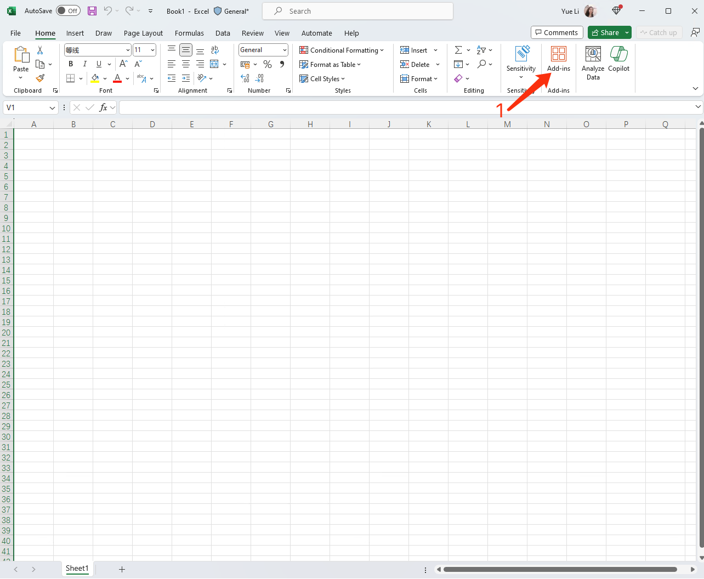
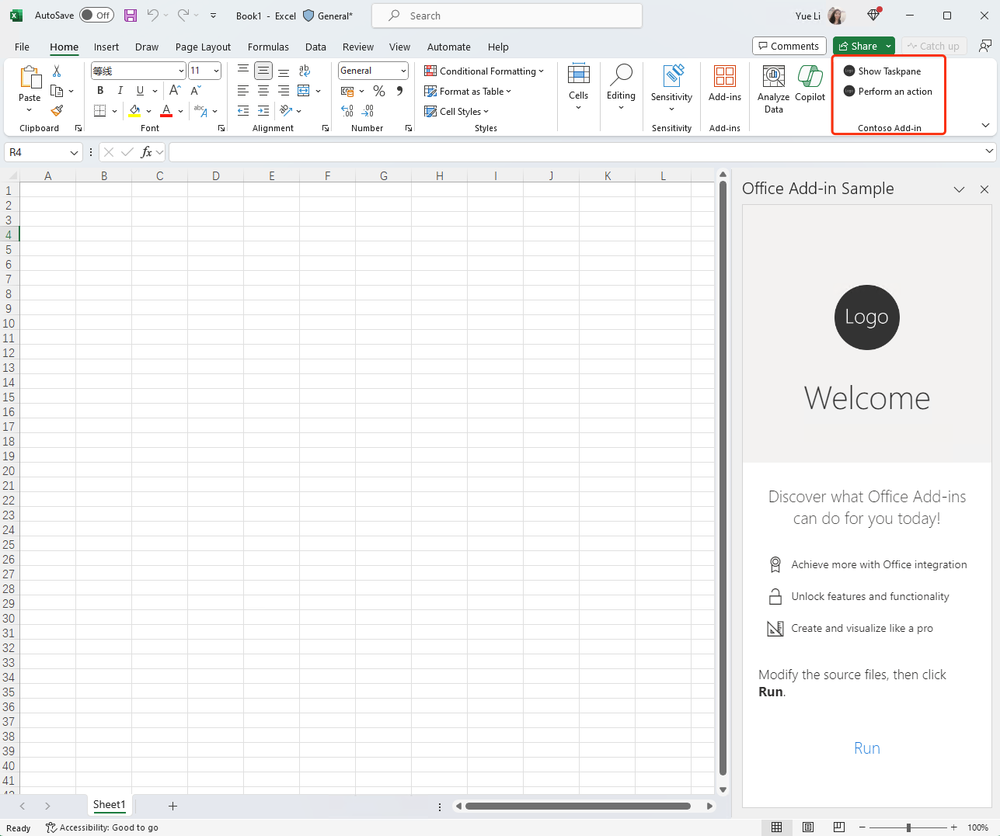

# Getting Started with Teams App for Office add-in Sample


## This sample illustrates

- How an Office add-in can support Word, Excel, PowerPoint and Outlook Apps by using the same JSON manifest.

## Prerequisites to use this sample
- [Node.js](https://nodejs.org) 16/18 (Tested on 16.14.0)
- [Teams Toolkit Visual Studio Code Extension](https://aka.ms/teams-toolkit) version 5.7.0 and higher.
- Office connected to a Microsoft 365 subscription (including Office on the web). If you don't already have Office, you might qualify for a Microsoft 365 E5 developer subscription through the [Microsoft 365 Developer Program](
https://developer.microsoft.com/en-us/microsoft-365/dev-program);
for details, see the [FAQ](
https://learn.microsoft.com/en-us/office/developer-program/microsoft-365-developer-program-faq#who-qualifies-for-a-microsoft-365-e5-developer-subscription-).
Alternatively, you can [sign up for a 1-month free trial](
https://www.microsoft.com/en-us/microsoft-365/try?rtc=1)
or [purchase a Microsoft 365 plan](
https://www.microsoft.com/en-us/microsoft-365/buy/compare-all-microsoft-365-products).


## Create Teams App for Office add-in


## Create Teams App for Office add-in


Once Excel is open, you can click the first step to show your add-in in flyout.


Find your add-in and click it, you will see the taskpane look as shown in the following image.


## Edit the manifest

You can find the app manifest in `./appPackage` folder. The folder contains one manifest file:

- `manifest.json`: Manifest file for Teams app running locally or running remotely (After deployed to Azure).

This file contains template arguments with `${{...}}` statements which will be replaced at build time. You may add any extra properties or permissions you require to this file. See the [schema reference](https://docs.microsoft.com/en-us/microsoftteams/platform/resources/schema/manifest-schema) for more information.


## File structure
```
| .eslintrc.json
| .gitignore
| .vscode
|   | extensions.json
|   | launch.json              Launch and debug configurations
|   | settings.json
|   | tasks.json
| appPackage
|   | assets                   Static assets like image/gif
|   | manifest.json            Manifest file
| babel.config.json
| env
|   | .env.dev
| images
| infra
|   | azure.bicep
|   | azure.parameters.json
| package.json
| README.md                    Get started here
| src                          Add-ins source code
|   | commands                 Add-ins commands code
|   |   | commands.html
|   |   | commands.ts
|   |   | excel.ts
|   |   | outlook.ts
|   |   | powerpoint.ts
|   |   | word.ts
|   | taskpane                 Add-ins taskpane code
|   |   | excel.ts
|   |   | outlook.ts
|   |   | powerpoint.ts
|   |   | taskpane.css
|   |   | taskpane.html
|   |   | taskpane.ts
|   |   | word.ts
| teamsapp.yml                Config file for M365/Teams Toolkit support
| tsconfig.json
| webpack.config.js           Webpack config
```

### Validate manifest file

To check that your manifest file is valid:

- From Visual Studio Code: open the command palette and select: `Teams: Validate Application` and select `Validate using manifest schema`.
- From TeamsFx CLI: run command `teamsapp validate` in your project directory.


## Version History

|Date| Author| Comments|
|---|---|---|
|March 22, 2024| yueli2 | create sample|

## Feedback

We really appreciate your feedback! If you encounter any issue or error, please report issues to us following the [Supporting Guide](https://github.com/OfficeDev/TeamsFx-Samples/blob/dev/SUPPORT.md). Meanwhile you can make [recording](https://aka.ms/teamsfx-record) of your journey with our product, they really make the product better. Thank you!